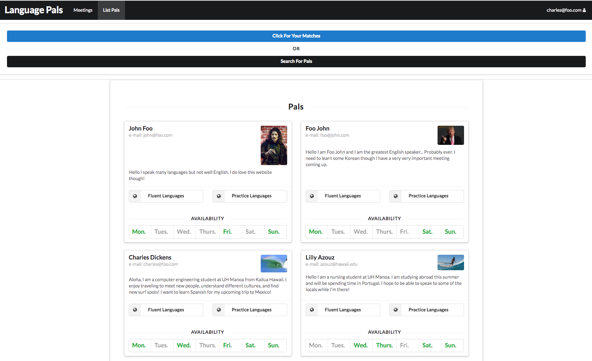

# About LanguagePals

[Language Pals](http://languagepals.meteorapp.com)

The problem: UH has a second language requirement, but it is often difficult to find people to practice the language with, even though the large number of foreign students means there is a large potential pool of candidates (who might, in turn, want to practice their English).

The solution: LanguagePals will match up students who are fluent in, for example, English and need practice in a foreign language, with students who are fluent in the foreign language but need practice in English. We at LanguagePals know that the best way to learn a new language is by practicing with a skilled speaker.

# About Our Team

## Charles Dickens
Hello, I am a Junior Computer Engineering student at UH Manoa with a variety of interests related to Engineering and Computer Science. Currently I am working on projects related to Data Analysis. My goals for this project are to build a user friendly application that can be used to connect people who want to share their knowledge and practice new language skills. I hope to develop skills in project management and planning, version control tools, and application design. Skills and positive attributes that I will contribute to the team include a good work ethic and attitude, leadership, and a developing knowledge of JavaScript, React, Semantic UI, Meteor, and Mongo DB.

## Nathan Onaka
I am a Junior at UH Manoa majoring in Computer Science, with interests in software design, security, and computer networking.  I picked this project because many of my friends and I are learning 2nd languages, and having an application like this would be fun and helpful to use.  While working on this project I hope to improve my time management and design skills.  My experience with teamwork and JavaScript will help us to achieve our goal of completing this application.

# Current State

So far we have here the landing page:

This page greets the user and describes the app. It also has a Login dropdown with signin and signup links for the user.

A returning user can sign in from the landing page using the Login button in the navbar. They will be taken to the sign in page where they must enter there email and password:

If this is the first time a user is Logging into the app then they can select the sign-up option from the Login dropdown at the landing page navbar. They will be take to Sign-up page where they enter their information for the app:

Once the user is logged in they can access the List-Pals page by clicking on the List-Pals button in the Nav-Bar. This page lists all the users of the app with their description, image, e-mail, and languages:

The edit pals page:

And the lastly the list and edit pals pages for the administrator:

# Milestone 1
This milestone started on Friday April 6th, 2018 and was completed on Thursday April 12th, 2018.

Our first milestone for the language pals app was to build a working version with the minimal features. Visit this link to the M1 Project page with the detailed issues we finished [Language Pals Milestone 1 Project](https://github.com/languagepals/languagepals/projects/1). For this milestone we built a landing page, a sign-in page, a sign-up page, a list pals page, an edit profile page, and some admin capabilities. 

# Milestone 2
This milestone started on Thursday April 12th, 2018.
[Language Pals Milestone 2 Project](https://github.com/languagepals/languagepals/projects/2)

Our Goals for this milestone are to add features so that:

-students can add constraints on when they can get together with another person to their profile to be displayed. 

-The ability to search/filter for students with specific availibilties and language skills.  

-A page of example “talk story” session outlines to help the meetups be productive.

-Addition of a meetings page and components for users to hold information such as who you are meeting with, when you are meeting, where/how, and notes of the meeting. This component can be accessed by whoever "attended" the meeting. A user can make a meeting and add different users. This meeting can be editted, kept after the actual meeting for your record or deleted. 

-The ability for the admin to delete profiles
