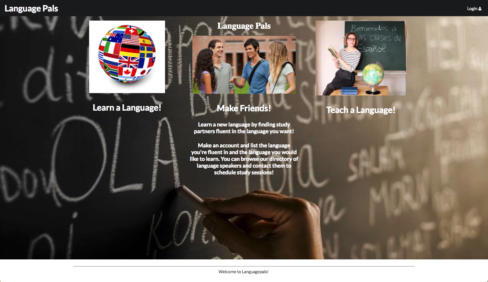
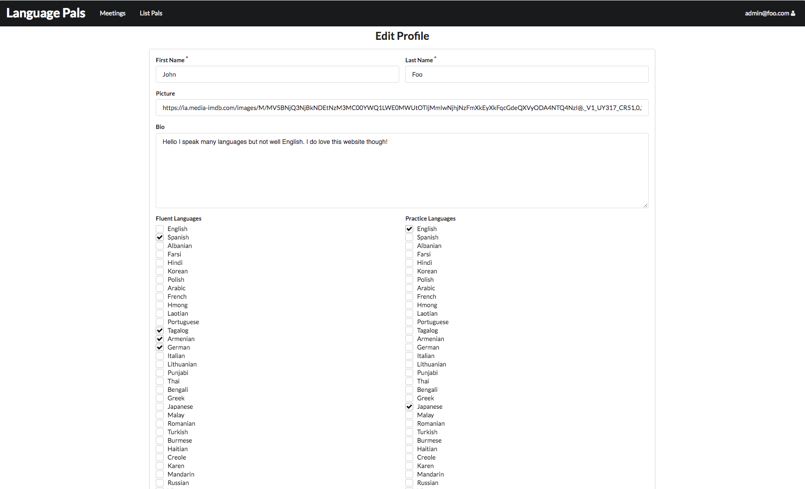

# Overview of LanguagePals

[Language Pals](http://languagepals.meteorapp.com)

The problem: UH has a second language requirement, but it is often difficult to find people to practice the language with, even though the large number of foreign students means there is a large potential pool of candidates (who might, in turn, want to practice their English).

The solution: LanguagePals will match up students who are fluent in, for example, English and need practice in a foreign language, with students who are fluent in the foreign language but need practice in English. We at LanguagePals know that the best way to learn a new language is by practicing with a skilled speaker.

# User Guide

The user is first welcomed at our landing page:


This page greets the user and describes the app. It also has a Login dropdown with signin and signup links for the user.

A returning user can sign in from the landing page using the Login button in the navbar. They will be taken to the sign in page where they enter there email and password:


If this is the first time a user is Logging into the app then they can select the sign-up option from the Login dropdown at the landing page navbar. They will be take to Sign-up page where they enter their information for the app:


Once the user is logged in they can access the List-Pals page by clicking on the List-Pals button in the Nav-Bar. This page lists all the users of the app with their description, image, e-mail, and languages:


From the List-Pals page a user can make a customized search for users based on their practice languages and fluent languages by clicking on the search for pals page to reveal the search menu, un-checking all, and submitting a query.


Or the user can click the Your Matches Button to display all the users that want to practice the language the user is fluent in and are fluent in the language the user wants to practice.


If a user wants to change their existing profile they can visit the edit profile page by clicking on the edit profile link from the profile dropdown located in the navbar:


If a user no longer wants their profile to be active then they can deavtivate it from the edit profile page:


If They click on that button they will be taken to the a page for confirmation. It is clarified that they will need to create a new profle after this action:


Their data is kept however, and when the user wants to re-activate their profile the fields in the create profile page will be already filled out and the user will just need to submit if they do not want to change their profile information.

Lastly we have an administrator account which can view all the active and deactive profiles and has the ability to edit and deactivate all profiles:


# Community Feedback

> "I'd like options to leave feedback or notes on for the person I'm meeting with, and maybe links to resources for the language I want to learn" | - Haroun Z.  Junior at UH, Architecture Major

> "Maybe a way to specify their proficiency in the fluent language, or list things they already know for the practice language.  So that they have a better understanding of what level each other are at" | - Courtney G. Junior at UH, Japanese Major

> "I wished the website was a little easier to navigate, more descriptive buttons and links." | - Kealohi A. Junior at UH, Nursing Major

> "I like being able to search for people and the design of the website. I would like more pages, like a whole profile page with more information about the person we could get to from the List Pals page" | - Hans S. Senior at UH, Political Science Major

> "I would like to have suggested resources for the language I want to learn, and maybe a clear way to organize a meeting with my pals" | - Lilly A. Junior at UH, Nursing Major

# Developer Guide

First, [install Meteor](https://www.meteor.com/install).

Second, clone or download a copy of [LanguagePals](https://github.com/languagepals/languagepals) from Github.
  
Third, cd into the app/ directory and install libraries with:

```
$ meteor npm install
```
Fourth, run the app with:
```
$ meteor npm run start
```
The application will then be live at [http://localhost:3000](http://localhost:3000).

# Milestone 1
This milestone started on Friday April 6th, 2018 and was completed on Thursday April 12th, 2018.

Our first milestone for the language pals app was to build a working version with the minimal features. Visit this link to the M1 Project page with the detailed issues we finished [Language Pals Milestone 1 Project](https://github.com/languagepals/languagepals/projects/1). For this milestone we built a landing page, a sign-in page, a sign-up page, a list pals page, an edit profile page, and some admin capabilities. 

# Milestone 2
This milestone started on Thursday April 12th, 2018, and was completed on Tuesday April 24th, 2018.
[Language Pals Milestone 2 Project](https://github.com/languagepals/languagepals/projects/2)

Our Goals for this milestone are to add features so that:

-Students can add constraints on when they can get together with another person to their profile to be displayed. 

-Students can add preferences for meeting in person, over skype, or phone

-The ability to search/filter for students with specific availibilties and language skills.  

-The ability for the admin to delete profiles

# Milestone 3
This milestone started on Tuesday April 24th, 2018.
[Language Pals Milestone 2 Project](https://github.com/languagepals/languagepals/projects/3)

Our Goals for this milestone are to add features so that:

-Addition of a meetings page and components for users to hold information such as who you are meeting with, when you are meeting, where/how, and notes of the meeting. This component can be accessed by whoever "attended" the meeting. A user can make a meeting and add different users. This meeting can be editted, kept after the actual meeting for your record or deleted. 

# About Our Team

## Charles Dickens
Hello, I am a Junior Computer Engineering student at UH Manoa with a variety of interests related to Engineering and Computer Science. Currently I am working on projects related to Data Analysis. My goals for this project are to build a user friendly application that can be used to connect people who want to share their knowledge and practice new language skills. I hope to develop skills in project management and planning, version control tools, and application design. Skills and positive attributes that I will contribute to the team include a good work ethic and attitude, leadership, and a developing knowledge of JavaScript, React, Semantic UI, Meteor, and Mongo DB.

## Nathan Onaka
I am a Junior at UH Manoa majoring in Computer Science, with interests in software design, security, and computer networking.  I picked this project because many of my friends and I are learning 2nd languages, and having an application like this would be fun and helpful to use.  While working on this project I hope to improve my time management and design skills.  My experience with teamwork and JavaScript will help us to achieve our goal of completing this application.

## Jiaqi Li
I am a Junior Computer Science student at UH Manoa with computer related interests such as software developing and cybersecurity. I wish to better understand software-design tools such as React, Semantic UI, Meteor, and Mongo DB, as well as to develop skills such as project management through the process of building our Languagepals application.

